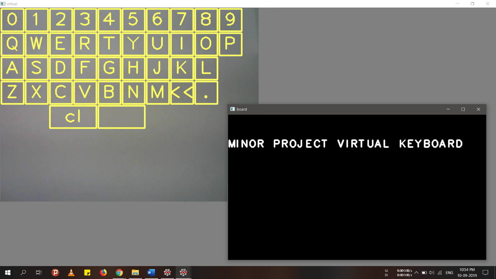

# Virtual-Keyboard-3.0

<a href="LICENSE" target="_blank"><a>
 

## About
A virtual keyboard is a software component that allows the input of characters without the need for physical keyboard. The interaction with the virtual keyboard happens mostly via a touchscreen interface, but can also take place in a different form in virtual or augmented reality.

## Features
- CV application that enables you to type anything by just using your device’s camera without using any physical keyboard.
- Project a keyboard layout to the camera background screen.
- Type anything by just using the hand gestures [type in air]. 
- Uses efficient algorithms like Convex Hull, Masking, Modular Indexing, etc., hence making it faster.

## Applications 
- Can be used as online examination tool.
- Beneficial to user with disabilities who cannot use a conventional keyboard.
- Takes Virtual Reality games to next level.
- Beneficial to bi- or multi-lingual users who switch frequently between different character sets or alphabets, which may be confusing over time.

# Screenshots #

||
|:--:|
|**Keyboard Layout**|

||
|:--:|
|**Modular Keyboard Architecture**|

||
|:--:|
|**Hand Detection**|

||
|:--:|
|**Face Removal & Hand Masking**|

||
|:--:|
|**Hand Gesture Typing**|

||
|:--:|
|**Output**|

## Tools Used
* [PHP](https://www.php.net/) : Used as the Web developement environment.
* [Open CV](https://www.php.net/) : Used as the Android developement environment.
* [Firebase Storage](https://firebase.google.com/products/storage) : Use to store product Image
* [XAMPP](https://www.apachefriends.org/index.html) : Used as the Webpage hosting server.

## Future Possibilities and Extension of this project
- Overcome the limitations like uneven brightness, improper face orientation, background-conflict.
- Use deep learning models like VGG 16 for more accurate results.
- Making it more faster!

## Author 
**Thanks for going through this Repository! Have a nice day.** 
 **Saurabh Roy** 
#### **Contact** :`roysaurabh1308@gmail.com`

## License
This Project is licensed under the MIT License, see the [LICENSE](LICENSE) file for details.
 
 

